# Azure SOC Honeynet with Microsoft Sentinel — Threat Hunting Edition

**Author:** Houssam Zouheir
**Stack:** Azure (VNet, NSG, VMs), Log Analytics Workspace, Microsoft Sentinel, KQL

> Azure SOC honeynet with Microsoft Sentinel: real attacker OSINT enrichment, custom KQL detection rules, MITRE ATT&CK mapping and incident report.

**Skills demonstrated:** cloud security (Azure NSG, JIT, MFA, Private Endpoints), SIEM engineering (Sentinel analytics rules, workbooks), KQL threat hunting, OSINT enrichment (AbuseIPDB, VirusTotal, GreyNoise), MITRE ATT&CK mapping, incident reporting.

---

## Overview

This project deploys an intentionally exposed honeynet on Azure (2 Windows VMs, 1 Linux VM) and ingests their logs into a Log Analytics Workspace monitored by Microsoft Sentinel.

Beyond the classic before/after hardening comparison, it covers:

- OSINT enrichment of real attacker IPs (AbuseIPDB, VirusTotal, GreyNoise)
- Detection of brute-force, slow password spraying and anonymous SMB enumeration
- Custom Sentinel analytics rules written in KQL
- MITRE ATT&CK mapping
- An incident report based on attacks actually observed

**Result:** malicious flows *allowed* into the honeynet dropped from 620 to 0 after hardening (restrictive NSG, MFA, Just-In-Time VM Access). See [Limitations](#limitations) for how to read this number.

> **Ethical note:** this lab runs in an isolated Azure subscription with no real data and no production workloads. Every attacker IP shown is real internet scanner noise received by the honeynet; no attack was launched by me.

## Architecture

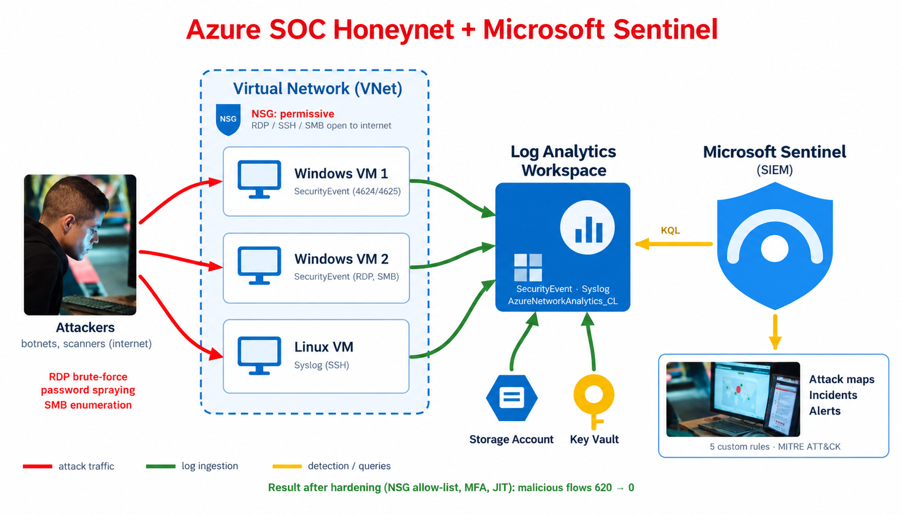

*Attack traffic (red) reaches the exposed VMs, logs flow into the Log Analytics Workspace (green), and Microsoft Sentinel queries them with KQL (yellow) to produce attack maps, incidents and alerts.*

Components:

- Virtual Network (VNet) and Network Security Group (NSG)
- 2 Windows VMs + 1 Linux VM
- Log Analytics Workspace
- Azure Key Vault and Storage Account
- Microsoft Sentinel

### Before hardening

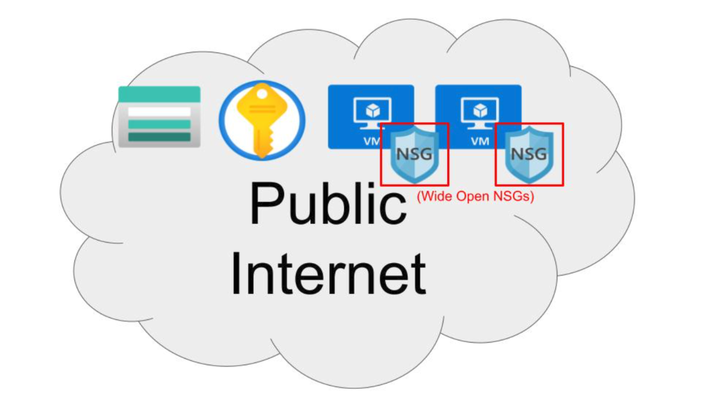

Every resource is directly reachable from the public internet. The three VMs sit behind NSG rules `ANY → ANY` (RDP 3389 and SMB 445 on the Windows VMs, SSH 22 on the Linux VM), and the Storage Account and Key Vault have public access enabled. No MFA, no geo-restriction, no Just-In-Time access. Result: **620 malicious flows allowed in 24 h**.

### After hardening

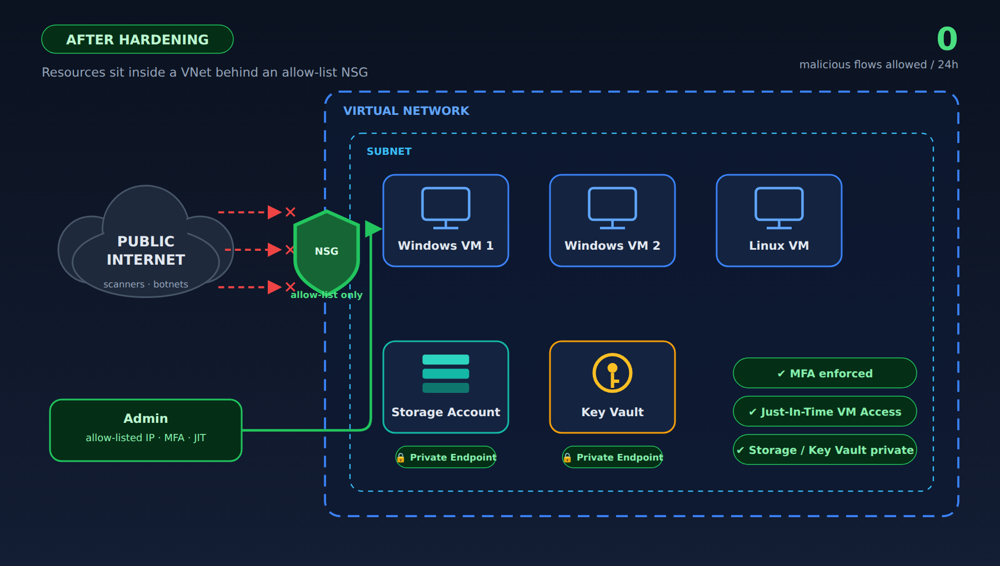

Resources sit inside a VNet subnet behind an allow-list NSG. Scanner traffic from the internet is blocked at the NSG, and only the admin (allow-listed IP, MFA, JIT) gets through. The Storage Account and Key Vault are protected with Private Endpoints / firewall rules (PE / FW). Result: **0 malicious flows allowed in 24 h**.

## Data sources

| Table | Content |
|---|---|
| `SecurityEvent` | Windows Event Logs |
| `Syslog` | Linux Event Logs |
| `SecurityAlert` | Log Analytics alerts |
| `SecurityIncident` | Incidents created by Sentinel |
| `AzureNetworkAnalytics_CL` | Malicious flows allowed into the honeynet |

## Before / After hardening

> **Two observation windows.** The before/after metrics below come from the April 2024 run. The hunting results in Parts 2 and 4 (password spraying, anonymous SMB sessions) come from a later observation window (28–29/09) on the same honeynet.

<!-- TODO: verify these periods and values match your final run -->

| Period | Start | End |
|---|---|---|
| Before hardening | 2024-04-13 13:53:48 | 2024-04-14 13:53:48 |
| After hardening | 2024-04-15 11:50:28 | 2024-04-16 11:50:28 |

| Metric | Before | After | Reduction |
|---|---|---|---|
| SecurityEvent | 7671 | 3894 | -49% |
| Syslog | 833 | 6 | -99% |
| SecurityAlert | 4 | 0 | -100% |
| SecurityIncident | 59 | 0 | -100% |
| AzureNetworkAnalytics_CL | 620 | 0 | -100% |

`SecurityEvent` does not fall to zero because it also contains legitimate activity (system events and authorized administrative logons), which remains after hardening.

---

## Part 1 — Threat Intelligence enrichment (OSINT)

Each unique source IP found in `AzureNetworkAnalytics_CL` was enriched with AbuseIPDB, VirusTotal, GreyNoise and ASN/geolocation lookups. Query: [`queries/01_top_attacker_ips.kql`](queries/01_top_attacker_ips.kql)

```kql
AzureNetworkAnalytics_CL
| where FlowType_s == "MaliciousFlow" and AllowedInFlows_d > 0
| where TimeGenerated >= ago(24h)
| summarize AttackCount = count(), TotalFlows = sum(AllowedInFlows_d) by SrcIP_s
| order by TotalFlows desc
| take 20
```

The table separates what OSINT reports about each IP from what was actually seen in the honeynet logs.

| Source IP | Country | ASN / Provider | OSINT reputation | Reported by OSINT | Seen in my logs |
|---|---|---|---|---|---|
| 193.24.123.39 | Russia | AS200593 – Prospero OOO (bulletproof hosting) | 200 reports / 46 sources, VT 5/91 malicious | RDP brute-force, port scan | Malicious flows allowed; no successful logon |
| 186.67.38.171 | Chile | AS27651 – ENTEL Chile S.A. | 29 reports / 2 sources, VT 0/91, GreyNoise: Suspicious | SSH brute-force (2300+ attempts/h on a T-Pot honeypot) | 10 anonymous SMB sessions |
| 14.172.156.19 | Vietnam | — | 3 reports / 3 sources, VT 0/91 | SMB (445) port scan | 126 anonymous SMB sessions |
| 118.99.103.253 | Indonesia | AS17451 – BIZNET Networks | 0 reports, VT 0/91, GreyNoise: Suspicious | None reported | 206 anonymous SMB sessions (~1/s), RDP brute-force (varied dictionary) |
| 154.192.120.183 | Pakistan | — | 7 reports / 5 sources | Bad web bot, brute-force (history) | 6 anonymous SMB sessions |
| 218.147.202.136 | [TODO] | [TODO] | [TODO] | [TODO] | Slow password spraying (14 accounts, no successful logon) |

OSINT enrichment covers the six IPs above. The IPs that only appear in the spraying analysis (Part 2) and in Part 4 (`81.10.4.117`) are not enriched.

**Evidence**

| | |
|---|---|
| 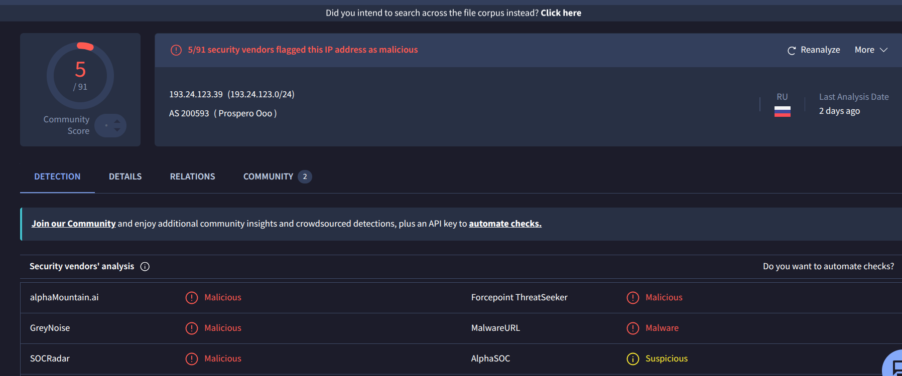 | 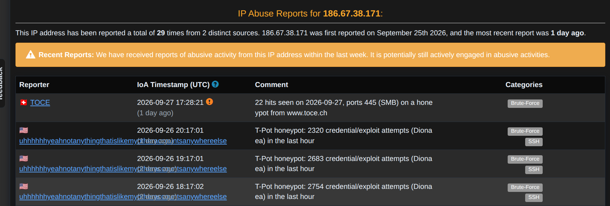 |
| VirusTotal: 193.24.123.39, 5/91 malicious (AS200593 Prospero OOO) | AbuseIPDB: 186.67.38.171, 29 reports / 2 sources (T-Pot honeypot reports) |
| 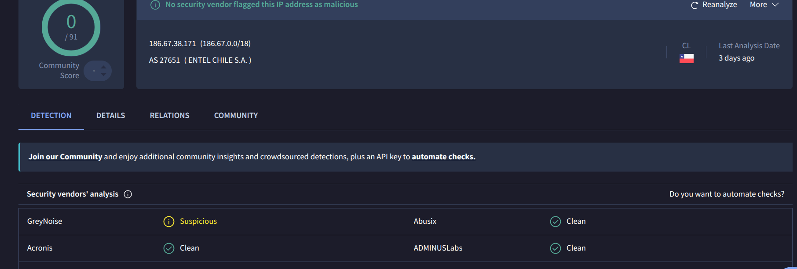 | 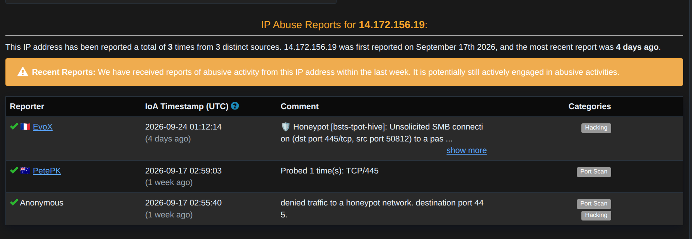 |
| VirusTotal: 186.67.38.171, 0/91 but GreyNoise: Suspicious | AbuseIPDB: 14.172.156.19, 3 reports / 3 sources (SMB 445) |
| 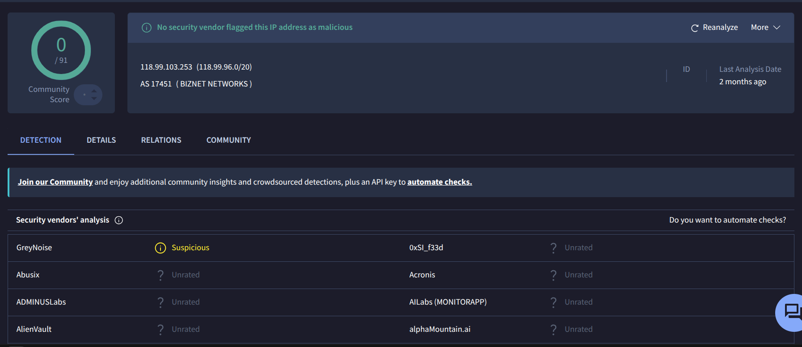 | 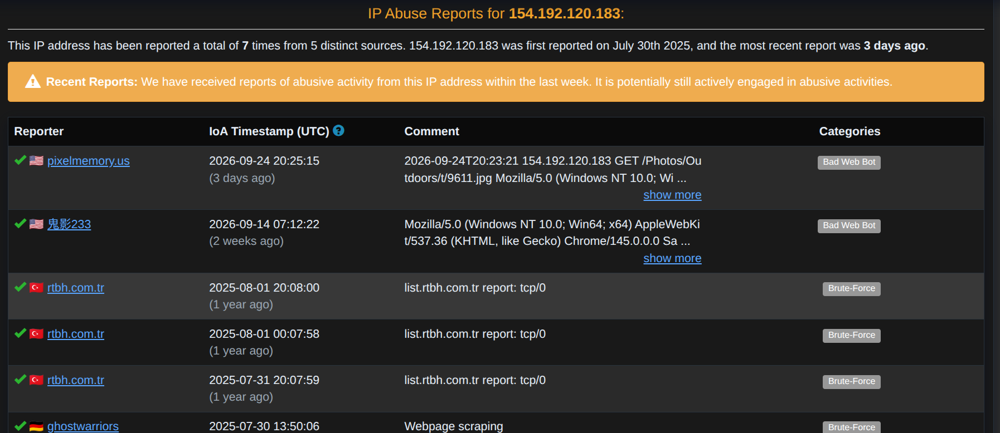 |
| VirusTotal: 118.99.103.253, 0/91 but GreyNoise: Suspicious | AbuseIPDB: 154.192.120.183, 7 reports / 5 sources |

**Key insight:** VirusTotal alone is not enough for recent automated scanning. 186.67.38.171 and 118.99.103.253 are flagged by GreyNoise yet score 0/91 on VirusTotal. Community-driven sources (AbuseIPDB) and internet-noise platforms (GreyNoise) are far more relevant than antivirus engines for this kind of threat.

<!-- TODO: run OSINT on 186.10.4.106, 186.72.55.152, 182.191.72.12, 94.26.68.54, 81.10.4.117 and 218.147.202.136 -->

## Part 2 — Brute-force and password spraying analysis (Event ID 4625)

Most targeted accounts ([`queries/02_top_targeted_accounts.kql`](queries/02_top_targeted_accounts.kql)):

```kql
SecurityEvent
| where EventID == 4625
| where TimeGenerated >= ago(24h)
| summarize FailedAttempts = count() by TargetAccount, IpAddress
| order by FailedAttempts desc
| take 20
```

Password spraying, short window ([`queries/03_spraying_hunt_10m.kql`](queries/03_spraying_hunt_10m.kql)):

```kql
SecurityEvent
| where EventID == 4625
| where TimeGenerated >= ago(1h)
| summarize DistinctAccounts = dcount(TargetAccount), Attempts = count() by IpAddress, bin(TimeGenerated, 10m)
| where DistinctAccounts >= 5
| order by Attempts desc
```

**Observed results**

- Generic dictionary accounts were the most targeted: `administrator`, `admin`, `guest`.
- The 10-minute spraying query returned several IPs rotating through many accounts (evening of 28/09, UTC):

| IP | Distinct accounts / 10 min | Attempts / 10 min | Bins observed |
|---|---|---|---|
| 186.10.4.106 | 6 – 10 | up to 433 | 18:50 – 19:20 |
| 186.72.55.152 | 5 – 7 | 146 – 211 | 19:20 – 19:30 |
| 182.191.72.12 | 5 | about 180 | 19:30 – 19:40 |
| 94.26.68.54 | 5 | 23 – 31 (steady) | 20:00 – 20:50 |
| 218.147.202.136 | 14 | 14 (one attempt per account per bin) | 20:00 – 20:40 |

- **218.147.202.136** is the clearest low-and-slow case: 14 distinct accounts, exactly one attempt per account every 10 minutes, repeated in every bin.
- 94.26.68.54 shows a different profile: a constant 5 accounts and about 30 attempts per bin.

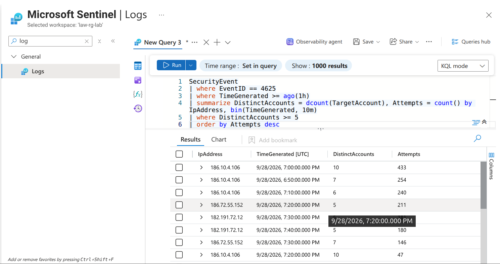

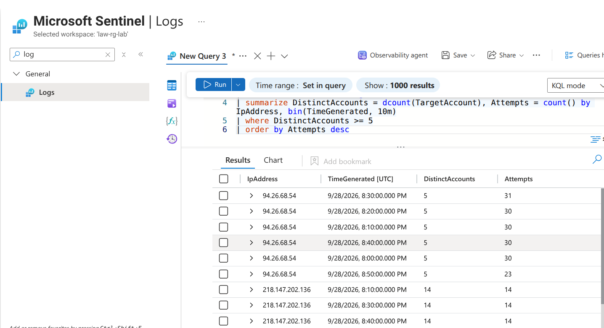

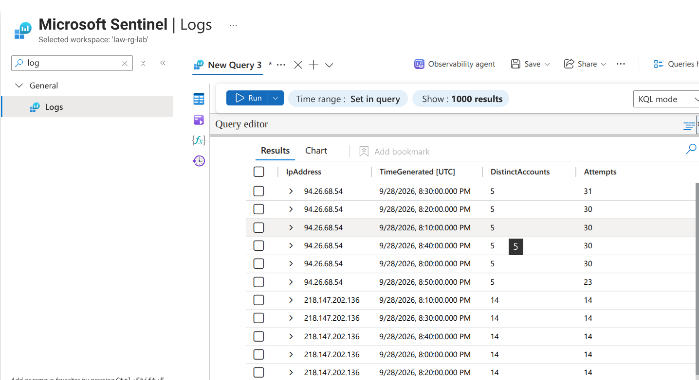

## Part 3 — Custom detection rules (Sentinel Analytics)

All rules are in [`queries/`](queries/). Rules 2 and 4 have no `TimeGenerated` filter in the query: the lookback is defined by the rule's query period in the Sentinel schedule (Rule 4: 24-hour lookback, run hourly).

**Rule 1 — Sequential port scan** (T1046)

```kql
AzureNetworkAnalytics_CL
| where TimeGenerated >= ago(1h)
| summarize DistinctPorts = dcount(DestPort_d) by SrcIP_s, bin(TimeGenerated, 5m)
| where DistinctPorts > 10
```

**Rule 2 — Successful logon after multiple failures** (T1110.001, T1078)

```kql
SecurityEvent
| where EventID in (4625, 4624)
| summarize FailedCount = countif(EventID == 4625), SuccessCount = countif(EventID == 4624) by TargetAccount, IpAddress, bin(TimeGenerated, 1h)
| where FailedCount > 10 and SuccessCount > 0
```

**Rule 3 — Abnormal Linux Syslog errors**

```kql
Syslog
| where SeverityLevel == "err" or SeverityLevel == "crit"
| summarize ErrorCount = count() by Computer, Facility, bin(TimeGenerated, 1h)
| where ErrorCount > 20
```

<!-- TODO: state whether Syslog data was present on linux-vm -->

**Rule 4 — Password spraying, 24-hour lookback** (T1110.003). Complements the 10-minute hunting query by also catching sprays spread over a longer period.

```kql
SecurityEvent
| where EventID == 4625
| summarize DistinctAccounts = dcount(TargetAccount), Attempts = count() by IpAddress
| where DistinctAccounts >= 5
```

**Rule 5 — Anonymous SMB sessions from external IPs** (T1135, T1087)

```kql
SecurityEvent
| where EventID == 4624 and LogonType == 3
| where TargetAccount has "ANONYMOUS LOGON"
| where IpAddress !in ("-", "127.0.0.1", "::1")
| summarize Sessions = count() by IpAddress, Computer, bin(TimeGenerated, 1h)
| where Sessions > 20
```

<!-- TODO: add a screenshot of a Sentinel incident generated by one of these rules, showing entity mapping (IP, account, host) and MITRE tactics -->

## Part 4 — Did anyone get in? Successful logon analysis

Successful logons (Event ID 4624) were checked for all known attacker IPs.

| IP | Events | Account | LogonType |
|---|---|---|---|
| 118.99.103.253 | 206 | NT AUTHORITY\ANONYMOUS LOGON | 3 |
| 14.172.156.19 | 126 | NT AUTHORITY\ANONYMOUS LOGON | 3 |
| 186.67.38.171 | 10 | NT AUTHORITY\ANONYMOUS LOGON | 3 |
| 81.10.4.117 | 8 | NT AUTHORITY\ANONYMOUS LOGON | 3 |
| 154.192.120.183 | 6 | NT AUTHORITY\ANONYMOUS LOGON | 3 |

**Interpretation:** these are SMB null sessions, not credential compromise. The roughly one-per-second rhythm of 118.99.103.253 indicates automated SMB reconnaissance (share/account enumeration), consistent with the open port 445 before hardening. 218.147.202.136 and 193.24.123.39 did not establish any successful session.

To confirm no real account was compromised from outside ([`queries/04_confirm_no_compromise.kql`](queries/04_confirm_no_compromise.kql)):

```kql
SecurityEvent
| where EventID == 4624 and TimeGenerated >= ago(7d)
| where LogonType in (3, 10)
| where TargetAccount !has "ANONYMOUS LOGON"
| where IpAddress !in ("-", "127.0.0.1", "::1")
| summarize Successes = count(), Accounts = make_set(TargetAccount) by IpAddress
| order by Successes desc
```

<!-- TODO: add the result of this query (expected: empty) -->

## Part 5 — MITRE ATT&CK mapping

| Technique observed | ID | Log source | Detection |
|---|---|---|---|
| Port scan / network reconnaissance | T1046 | AzureNetworkAnalytics_CL | Rule 1 |
| RDP/SSH brute-force | T1110.001 | SecurityEvent / Syslog | Default rule + Rule 2 |
| Password spraying | T1110.003 | SecurityEvent (4625) | Rule 4 |
| Network share discovery | T1135 | SecurityEvent (4624, anonymous) | Rule 5 |
| Account discovery | T1087 | SecurityEvent (4624, anonymous) | Rule 5 |
| Valid accounts (attempted) | T1078 | SecurityEvent (4624/4625) | Default Sentinel rule |
| Exploitation of exposed service | T1190 | AzureNetworkAnalytics_CL | Sentinel attack maps |

## Part 6 — Sentinel Workbook

A native Sentinel Workbook was built with:

- Geographic map of attacker IPs
- Hour-by-hour timeline of malicious activity
- Top 10 accounts targeted by brute-force
- Before/after hardening comparison

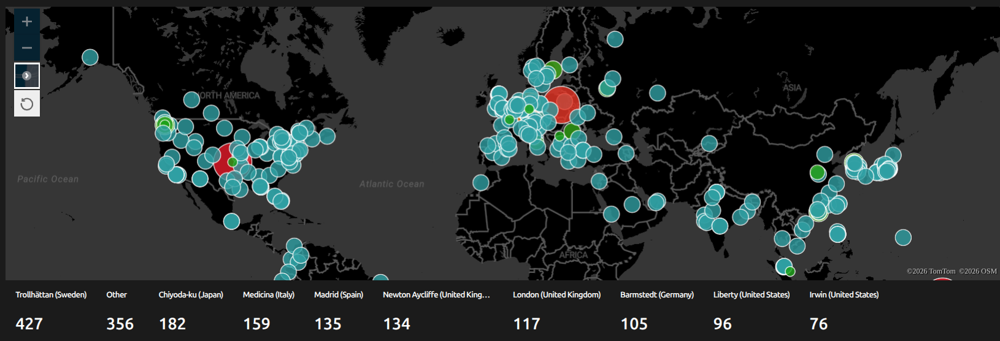

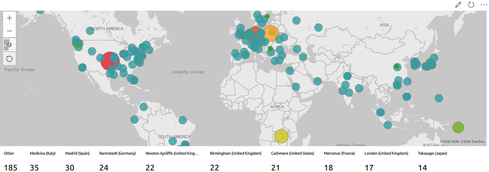

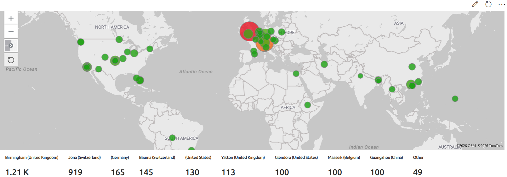

Activity peaks were not uniform over 24 hours, consistent with automated botnet scanning rather than manual, targeted intrusion.

## Part 7 — Incident report

Full report: [`report/incident_report.md`](report/incident_report.md)

**Summary:** slow password spraying (5 IPs, up to 14 accounts each) and anonymous SMB enumeration (5 IPs). No real account was compromised. Port 445 was exposed before hardening. Remediation: allow-listed NSG, JIT VM Access, MFA.

## How to reproduce

1. **Network and VMs:** create a resource group, a VNet, and an NSG with RDP/SSH/SMB open to the internet. Deploy 2 Windows VMs and 1 Linux VM in the subnet.
2. **Log collection:** create a Log Analytics Workspace, enable Microsoft Sentinel on it, and install the Azure Monitor Agent on the VMs with data collection rules for `SecurityEvent` and `Syslog`.
3. **Network telemetry:** feed NSG flow data into the workspace so that `AzureNetworkAnalytics_CL` is populated.
4. **Detection:** create the analytics rules from [`queries/`](queries/) in Sentinel, with entity mapping (IP, account, host) and MITRE tactics; build the workbook.
5. **Observe:** leave the honeynet exposed for 24 hours and collect the "before" metrics.
6. **Harden:** restrict the NSG to allow-listed IPs, enforce MFA, enable JIT VM Access, and put the Storage Account and Key Vault behind Private Endpoints / firewall rules. Collect the "after" metrics over another 24 hours.
7. **Clean up:** delete the resource group to stop all costs.

Estimated cost: <!-- TODO: add the real cost of the lab -->

## Limitations

- **One day before, one day after.** The comparison covers a single 24-hour window on each side, so it shows a clear effect but is not a statistical study.
- **620 → 0 counts allowed flows only.** The query filters on `AllowedInFlows_d > 0`, so a restrictive NSG naturally brings it to zero. It proves the NSG blocks unwanted traffic, not that scanners stopped coming. <!-- TODO: add blocked flows from NSG flow logs to show that scanning continued -->
- **No firewall or endpoint telemetry** beyond the VMs' own logs and NSG flows, so correlation is limited.
- **Rule 2 can produce false positives** (a legitimate user mistyping a password, then succeeding); thresholds would need tuning in production.
- **OSINT reputation is a snapshot** and reflects how much each IP has been reported by others, not proof of intent.

## Repository structure

```
azure-soc-honeynet-sentinel/
├── README.md
├── queries/        (.kql files: hunting queries, Rules 1-5)
├── screenshots/    (workbook maps, OSINT evidence, spraying results)
└── report/         (incident report)
```

## Key takeaways

- The honeynet was discovered by mass automated scanners, not targeted attackers.
- VirusTotal alone is insufficient for recent scan/brute-force noise; combine AbuseIPDB and GreyNoise.
- Password spraying shows up as many distinct accounts per IP in a short window; a `dcount(TargetAccount)` threshold catches even one-attempt-per-account rotation, and a longer lookback covers slower sprays.
- Successful logon events must be read carefully: anonymous LogonType 3 sessions are enumeration, not credential compromise.
- Hardening (NSG, MFA, JIT) eliminated the malicious flows allowed into the honeynet (620 → 0).
